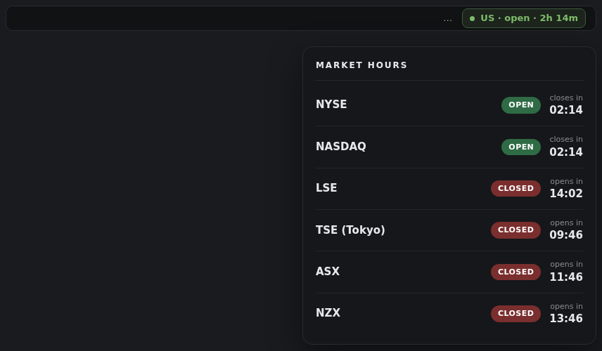

# Market Hours

Session clock for the [Omarchy](https://omarchy.org) Quattro bar. Shows when major equity markets are open, closed, or in extended hours — no quotes, no network, no API keys.

**Exchanges:** NYSE · NASDAQ · LSE · TSE (Tokyo) · ASX · NZX



## Install

```bash
omarchy plugin add https://github.com/McX424/omarchy-market-hours.git --enable
```

Place or move the widget if needed:

```bash
omarchy bar put mcx424.market-hours --section right
```

Validate after install:

```bash
omarchy plugin validate ~/.config/omarchy/plugins/mcx424.market-hours
```

## Usage

- **Left click** the chip to open the details panel
- Chip shows US session state and countdown (for example `US · open · 2h 14m` or `US · extended · 1h 20m`)
- Panel lists each exchange with **OPEN** / **CLOSED** / **EXTENDED** and time until the next change

## Session hours

| Exchange | Timezone | Session |
|----------|----------|---------|
| NYSE / NASDAQ | America/New_York | Pre 04:00–09:30 EXTENDED · regular 09:30–16:00 OPEN · AH 16:00–20:00 EXTENDED |
| LSE | Europe/London | 08:00–16:30 |
| TSE (Tokyo) | Asia/Tokyo | 09:00–11:30 · 12:30–15:00 (lunch closed) |
| ASX | Australia/Sydney | 10:00–16:00 |
| NZX | Pacific/Auckland | 10:00–16:45 |

US early-close and full holidays come from the bundled calendar in `data/us-equity-holidays-2026.json`.

## Configure

Defaults live in `manifest.json`. Override via Omarchy bar widget settings or the `mcx424.market-hours` entry in `shell.json`.

| Key | Default | Description |
|-----|---------|-------------|
| `displayTimezone` | `America/New_York` | IANA timezone for countdown display |
| `showCountdown` | `true` | Show time until next state change |
| `countDownToPre` | `false` | Count down to pre-market instead of regular open |
| `usPreStart` | `04:00` | US pre-market start (Eastern time) |
| `usRegularOpen` | `09:30` | US regular open (Eastern time) |
| `usRegularClose` | `16:00` | US regular close (Eastern time) |
| `usAhEnd` | `20:00` | US after-hours end (Eastern time) |
| `tickSeconds` | `30` | Refresh interval |

APAC tip: set `displayTimezone` to `Pacific/Auckland` (or your local IANA zone) so countdowns read in local wall time.

## Limitations

- Clock only — no quotes, no network
- Non-US holiday calendars are not bundled in v1 (weekdays-only for LSE, TSE, ASX, NZX)
- US holiday data is for 2026; refresh the JSON for later years
- Extended-hours windows vary by broker

## Update

```bash
omarchy plugin update mcx424.market-hours
```

## Remove

```bash
omarchy plugin remove mcx424.market-hours
```

## Sources

- US hours and holidays: [NYSE Holidays & Trading Hours](https://www.nyse.com/markets/hours-calendars)
- Other venues: standard cash-session hours in local time

Not trading advice. Extended-hours windows vary by broker.

## License

MIT
